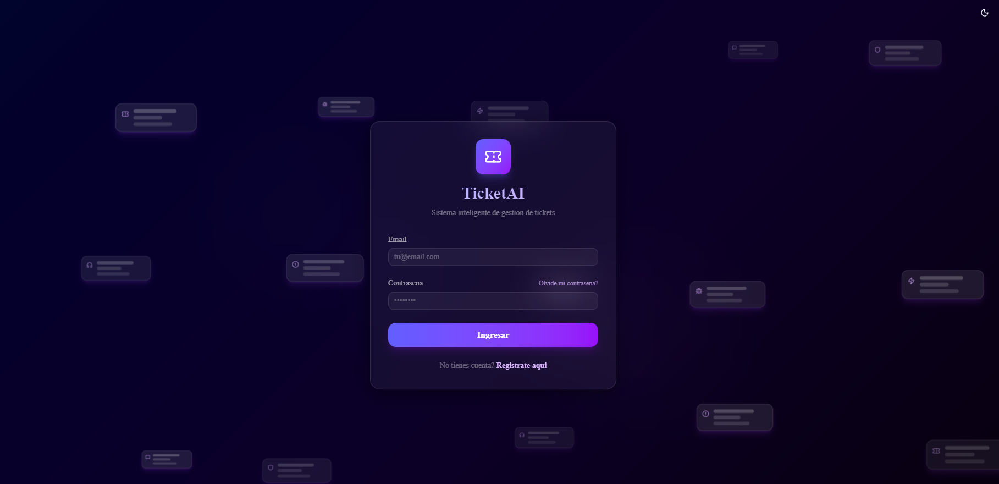
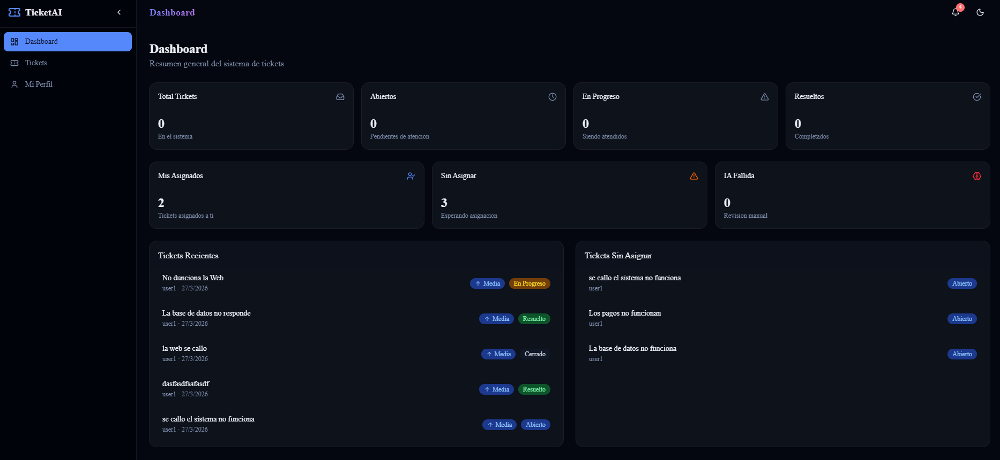
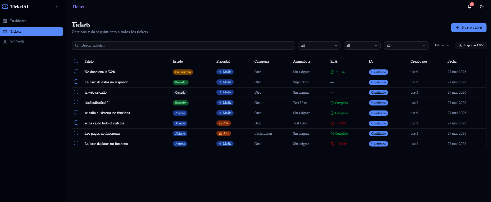
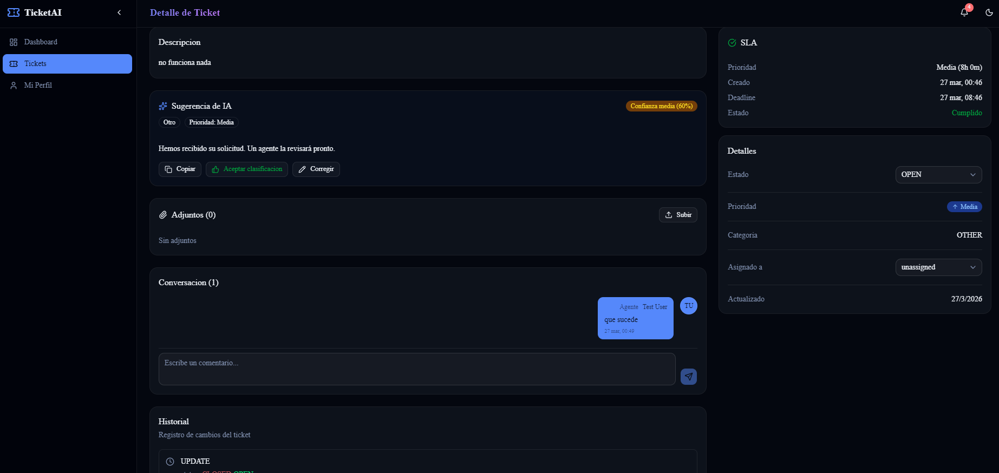

# AI-Powered Ticket Management System
Sistema de gestion de tickets con clasificacion automatica por inteligencia artificial, arquitectura de microservicios y actualizaciones en tiempo real.

## Screenshots

| Login | Dashboard de Agente |
|-------|-------------------|
|  |  |

| Lista de Tickets | Detalle con Clasificacion IA |
|-----------------|------------------------------|
|  |  |

## Que hace este proyecto

Un sistema completo donde los usuarios crean tickets de soporte y la IA los clasifica automaticamente por categoria, prioridad y genera una respuesta sugerida. Incluye tres vistas segun el rol: portal de usuario, dashboard de agente y panel de administrador.

**Funcionalidades principales:**
- Creacion y seguimiento de tickets con SLA configurable
- Clasificacion automatica por IA (OpenAI / Gemini) con Strategy Pattern
- Notificaciones en tiempo real via WebSocket
- Sistema de comentarios con indicador de mensajes nuevos
- Autenticacion JWT con refresh token rotation
- Vistas diferenciadas por rol (Usuario, Agente, Admin)

## Tech Stack

| Capa | Tecnologias |
|------|-------------|
| **Frontend** | Next.js 16, React 19, TypeScript, Tailwind CSS 4, Zustand, TanStack Query, Framer Motion |
| **API Gateway** | Hono, Socket.IO, Bun |
| **Ticket Service** | Hono, Prisma 6, Bun |
| **AI Worker** | Node.js, OpenAI / Gemini SDK, Redis Pub/Sub |
| **Base de datos** | PostgreSQL 16, Redis 7 |
| **Infraestructura** | Docker Compose, Turborepo, pnpm workspaces |

## Arquitectura

```
┌─────────────┐     HTTP      ┌──────────────┐     HTTP      ┌─────────────────┐
│   Frontend   │ ───────────► │  API Gateway  │ ───────────► │ Ticket Service  │
│  (Next.js)   │ ◄──── WS ──  │  (Hono+Bun)  │              │  (Hono+Prisma)  │
└─────────────┘              └──────────────┘              └────────┬────────┘
                                                                    │ Redis Pub/Sub
                                                            ┌───────▼────────┐
                                                            │   AI Worker    │
                                                            │ (OpenAI/Gemini)│
                                                            └────────────────┘
```

- **API Gateway** — Punto de entrada unico. Maneja autenticacion, rate limiting, CORS y WebSocket.
- **Ticket Service** — Logica de negocio, CRUD, auditoria y SLA. Publica eventos a Redis.
- **AI Worker** — Consume eventos de Redis y clasifica tickets automaticamente con IA.

## Inicio rapido

```bash
# 1. Clonar e instalar dependencias
git clone <repo-url>
cd project-ticket-gestion

# 2. Levantar PostgreSQL, Redis y MailDev
cd backend
cp .env.example .env
pnpm install
pnpm docker:up

# 3. Configurar base de datos
cd services/ticket-service
pnpm db:push

# 4. Iniciar backend (todos los servicios)
cd ../../
pnpm dev

# 5. Iniciar frontend (en otra terminal)
cd ../frontend/app
pnpm install
pnpm dev -p 3002
```

## Estructura del proyecto

```
project-ticket-gestion/
├── backend/
│   ├── services/
│   │   ├── api-gateway/        # Puerto 3000
│   │   ├── ticket-service/     # Puerto 3001
│   │   └── ai-worker/         # Worker en background
│   └── packages/
│       ├── database/           # Schema Prisma compartido
│       └── shared/             # Tipos y validaciones Zod
├── frontend/app/               # Next.js App Router
│   ├── src/app/(auth)/        # Login, registro
│   ├── src/app/(portal)/      # Vista usuario
│   ├── src/app/(dashboard)/   # Vista agente
│   └── src/app/(admin)/       # Vista admin
└── docs/rfcs/                  # Documentacion tecnica
```

## Variables de entorno

Copiar `backend/.env.example` a `backend/.env`. Variables clave:

| Variable | Descripcion |
|----------|-------------|
| `DATABASE_URL` | Conexion a PostgreSQL (puerto 5433) |
| `REDIS_URL` | Conexion a Redis |
| `JWT_SECRET` | Secreto para tokens JWT |
| `AI_PROVIDER` | `mock`, `openai` o `gemini` |
| `OPENAI_API_KEY` | API key de OpenAI (opcional) |
| `GEMINI_API_KEY` | API key de Gemini (opcional) |